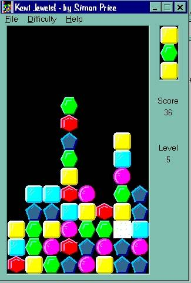



## Kewl Jewels\! \(better than Tetris\!\!\!\)

### Description

Kewl Jewels is a game similar to, but ALOT better than, Tetris. I decided to make a game that takes brains rather than joystick abuse, so read the 'readme' file because it's only fun if you know the rules. But, once you get it, it's the most addictive game I've ever made! Challenges you brain, requires quick, descisive thinking and it's really annoying when you lose! The idea is to make jewels disappear by aligning them in rows of 3 or more similar colours. Often, a 'chain reaction' occurs and you bring the whole tower down, which is really cool (or kewl!). This game shows lots of recursive algorithms and quadratic scoring methods meaning that you get rewarded tons more for bigger reactions. Also shows of a bit of simple BitBlt and Sound FX. If you find this game addictive, please vote. If you can honestly say that you only had just one go, then don't bother voting but I bet you can't play this just once!
 
### More Info
 

             |
---                |---
**Submitted On**   |2000-07-08 17:52:30
**By**             |[Simon Price](https://github.com/Planet-Source-Code/PSCIndex/blob/master/ByAuthor/simon-price.md)
**Level**          |Beginner
**User Rating**    |4.4 (40 globes from 9 users)
**Compatibility**  |VB 3\.0, VB 4\.0 \(16\-bit\), VB 4\.0 \(32\-bit\), VB 5\.0, VB 6\.0, VB Script, ASP \(Active Server Pages\) 
**Category**       |[Games](https://github.com/Planet-Source-Code/PSCIndex/blob/master/ByCategory/games__1-38.md)
**World**          |[Visual Basic](https://github.com/Planet-Source-Code/PSCIndex/blob/master/ByWorld/visual-basic.md)
**Archive File**   |[CODE\_UPLOAD7538782000\.zip](https://github.com/Planet-Source-Code/simon-price-kewl-jewels-better-than-tetris__1-9599/archive/master.zip)

